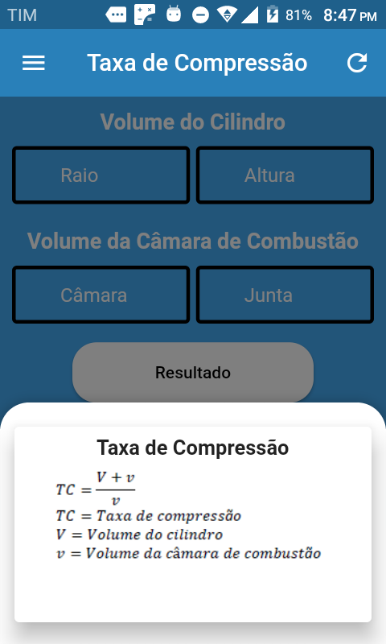
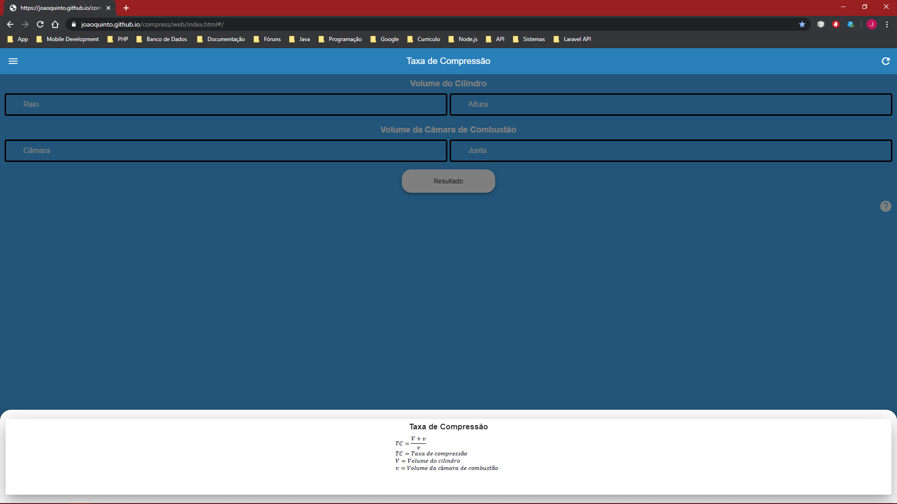
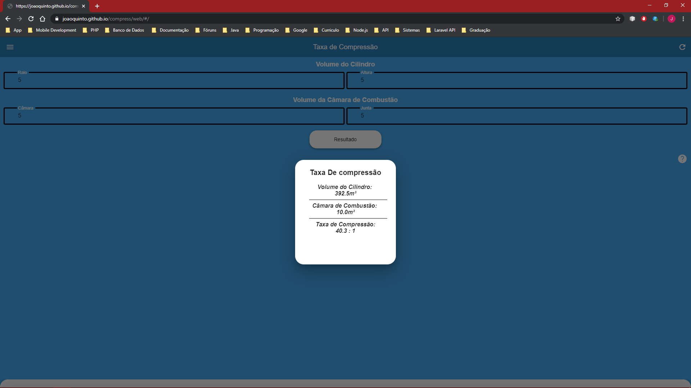
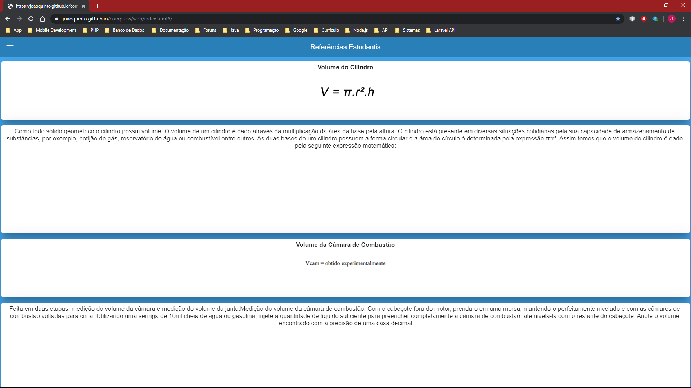

# tcompress

Um projeto feito totalmente em Flutter, com o intuito de utilizar novas Widgets e packages. E facilitar o cálculo da Taxa de Compressão de um motor

Com versão Web e Mobile.

Versão WEB:
https://joaoquinto.github.io/compress/web/#/

Versão MOBILE: 
https://drive.google.com/drive/folders/1nZY8gpscFXMVDNcsf_R8xGvdjDKjN24e?usp=sharing

Como: 
=====
 1. Card [Widget]
 2. SlidingUpPanel [Package] 
 3. Splash Screen  [Package]
 4. Url Launcher   [Package]
 5. DrawerHeader   [Widget]
 6. ListTile       [Widget]  
 7. SizedBox       [Widget]  
 8. Expanded       [Widget]
 9. Alert Dialog   [Widget]
 11. Flutter Share [Package]
 12. ExpansionTile [Widget]
 13. flutter_launcher_icons [Package]
 14. Url Launcher web [Package]

# Inicio.
Quarta-feira, ‎29‎ de ‎janeiro‎ de ‎2020.

# Fim.
Sem previsão.

Obs:
====
Ainda é necessário explorar a responsividade para tratar os espaços mortos que ficam em telas grandes.

Icone para o App [FEITO]

Vontades Futuras
================
1. Flutter Web [FEITO]
2. Flutter Desktop

Print Screen mobile
====================

Ícone do app:

Splash Screen:

Taxa de Compressão:

Fórmula do Cálculo:

Resultado do Cálculo:

Menu:

Referêcias Estudantis:

Sobre:

Print Screen Web
================

Splash Screen:

Taxa de Compressão:

Fórmula do Cálculo:

Resultado do Cálculo:

Menu:

Referêcias Estudantis:

Sobre:

Alert informativo web:

